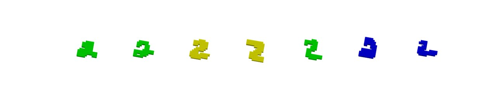
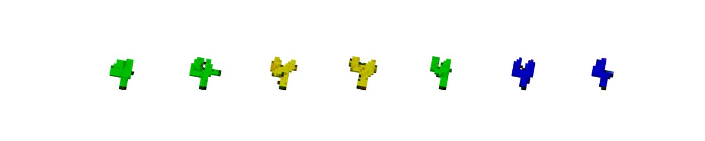
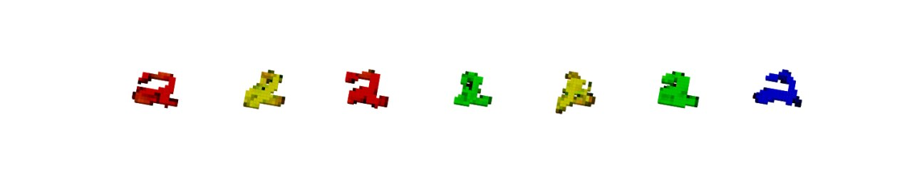

# Neural Optimal Transport for 3D Mnist samples

The whole repo is based on beautiful [NOT paper](https://openreview.net/forum?id=d8CBRlWNkqH) & corresponding [Repo](https://github.com/iamalexkorotin/NeuralOptimalTransport), with modification such that NOT finds weak optimal transport plan between [3D Mnist samples](https://openreview.net/forum?id=d8CBRlWNkqH).

## Table of Contents
- [NOT in 3D](#Idea)
- [Repository structure](#repo)
- [Examples](#examples)
- [Installation](#install)
- [Running commands](#running)
## NOT in 3D
For base models, we took original [Unet](https://arxiv.org/abs/1505.04597) model and changed all `Conv` layers to `Conv3D`.
## Repository structure
Main code is contained in `src` folder. For training and results monitoring in cmd interface checkout `run.py` script.
You can load checkpoint and validate it (via saving OT samples) through using `load_checkpoint.ipynb`

## Checkpoints
From 3D MNIST colored twos to 3D MNIST colred fours:  [google drive link](
https://drive.google.com/file/d/1kFqCJafAmQVrDFUhWTRKioM8tUfPFB7h/view?usp=sharing)

## Running commands
To run training script:
```
python run.py
```
Checkpoints and visulization of X and T(X) will be save in ```checkpoints``` directory
## Examples
You can download checkpoint using this [google drive link](
https://drive.google.com/file/d/1kFqCJafAmQVrDFUhWTRKioM8tUfPFB7h/view?usp=sharing) and get pics yourself by running `load_checkpoint.ipynb`

3D MNIST Optimal transport between initial distribution of colored 2s to target distribution of 4s:

X


T(X)



Optimal transport in reverse:

X


T(X)



## Installation (Using conda)
To install all required dependencies, you can run
```
conda create --name 3DNOT --file requirements.txt
```

## Credits
Final project for Machine Learning course 2023 at Skoltech was done by Maksim Bobrin, Sergei Kholkin, Anastasia Batsheva, Artem Basharin.